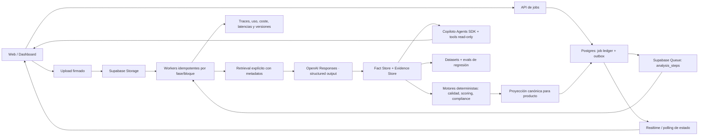

# ADR-001 — Arquitectura de IA durable, grounded y evaluable

- **Estado:** Aceptada para implementación incremental
- **Fecha:** 2026-07-16
- **Ámbito:** análisis de pliegos y copiloto sobre análisis persistidos

## Contexto

El pipeline actual aporta extracción estructurada y evidencias, pero concentra toda la ejecución en una petición SSE de hasta 280 segundos. La ingesta, el mapa documental y nueve extracciones dependen de que una única Edge Function siga viva; el job se crea después de la ingesta y una interrupción puede perder trazabilidad. Cada bloque repite `file_search`, el mapa documental no filtra de forma efectiva la recuperación y el resultado persistido mezcla hechos, proyección de UI y diagnóstico.

El benchmark de release valida JSON ya generado. Hasta esta decisión no existía una evaluación versionada que llamase al mismo pipeline/modelo y midiese exactitud, no-alucinación y grounding. Por tanto, cambiar modelo, prompts o retrieval sin una línea base real era una decisión sin gate semántico.

La aplicación necesita:

1. tolerar expedientes grandes y reintentos sin depender de la vida de una petición HTTP;
2. responder solo con hechos trazables al documento, página y fragmento;
3. separar extracción determinista de conversación/agencia;
4. evolucionar modelos y prompts con evidencia cuantitativa;
5. incorporar después Go/No-Go, scoring, compliance y riesgos sin contaminar el schema de extracción.

## Decisión

Se adopta una arquitectura objetivo orientada a jobs durables, hechos/evidencias y evaluación continua. La migración será por capas; esta ADR no autoriza un reemplazo “big bang”.

### 1. Control plane durable

- La API valida ownership y metadatos, crea `analysis_job` **antes** de llamar a OpenAI y devuelve `202 + jobId`.
- El navegador sube documentos directamente a Storage mediante URL firmada; el body de la Edge Function deja de transportar base64.
- Postgres es la fuente de verdad del estado. La transición de estado y el enqueue se realizan de forma transaccional mediante patrón outbox/queue.
- Supabase Queues es el transporte por defecto por afinidad con el stack. Cada mensaje representa una fase o bloque pequeño, con `job_id`, `step`, `attempt`, `input_hash` e `idempotency_key`.
- Los workers toman mensajes con lease, escriben checkpoint antes del ack, aplican backoff con jitter y envían a dead-letter al agotar intentos. Repetir un mensaje no puede duplicar hechos ni costes evitables.
- SSE queda como fachada opcional de estado; la continuidad se obtiene desde el ledger/Realtime, no desde mantener abierta la ejecución.

### 2. Data plane documental y retrieval

- Cada archivo se identifica por hash y se normaliza una vez. OCR se aplica solo cuando el detector de capa de texto lo justifica.
- Los chunks incorporan `tenant_id`, `job_id`, `document_id`, tipo documental, página, sección, lote y hash de contenido.
- El mapa documental se convierte en router: determina qué documentos/secciones consultar para cada bloque. No vuelve a incluir el expediente completo por defecto.
- La recuperación devuelve fragmentos explícitos con score y metadatos. El extractor recibe un contexto limitado y auditable; las citas se validan contra los fragmentos recuperados.
- Se conserva una abstracción `RetrievalProvider` para no acoplar el dominio a un vector store concreto.

### 3. Fact Store y Evidence Store

El artefacto primario deja de ser solo el JSON del dashboard. Cada hecho mantiene:

- `field_path`, valor normalizado, unidad y estado (`extraido`, `derivado`, `ambiguo`, `no_encontrado`);
- `document_id`, página, cita, chunk y confianza;
- versión de modelo, prompt, schema, pipeline y retrieval;
- timestamp, hash de entrada y reglas de derivación si aplica.

La salida canónica actual pasa a ser una proyección versionada del Fact Store. Scoring, compliance, riesgos y Go/No-Go consumen hechos trazables y producen resultados separados; nunca sobrescriben la evidencia original.

### 4. OpenAI: Responses para extracción, Agents SDK para conversación

- Las tareas acotadas (mapa, clasificación, extracción por bloque, resolución de ambigüedades) usarán Responses con salida estructurada y validación de schema. La aplicación conserva el control del workflow, reintentos y estado.
- Agents SDK se reserva para bucles donde aporta valor real: copiloto conversacional, selección de tools y handoffs. Sus tools leen Fact/Evidence Store con permisos del usuario; no comparten acceso genérico si el especialista no lo necesita.
- El routing de modelos es por tarea y por riesgo: modelo económico para clasificación/mapa, modelo de mayor capacidad para campos críticos/ambiguos y funciones deterministas para consolidación, normalización y scoring.
- No se promociona un modelo ni una versión mayor del SDK por novedad. Debe superar el dataset baseline en calidad, latencia y coste.

### 5. Evaluación y observabilidad como contrato

Se mantienen dos gates distintos:

1. `pnpm benchmark:pliegos`: fixtures canónicos + proyección de producto, determinista.
2. `pnpm eval:pliegos:live`: pipeline real + OpenAI, con exactitud de hechos, exactitud de ausencias, grounding de citas, calidad, degradación y latencia.

`pnpm eval:pliegos:check` prueba el scoring sin red y forma parte de `verify:release`. Los informes live registran versiones semánticas y fingerprint SHA-256 de los fuentes efectivos, pero no el documento ni la respuesta completa. La fuente de verdad del dataset vive en el repo; OpenAI Datasets puede utilizarse para experimentos y comparación visual sin convertir una plataforma externa en el único gate reproducible.

Cada step futuro debe emitir como mínimo: `job_id`, `request_id`, `trace_id`, versión/fingerprint, modelo, latencia, intentos, tokens/coste cuando el proveedor los exponga, ids de chunks recuperados y resultado de validación. Logs y trazas deben redactar contenido sensible.

### 6. Seguridad y aislamiento

- RLS/ownership se valida al crear el job y en cada tool conversacional.
- Storage usa rutas por usuario/tenant, URLs de vida corta y política de retención explícita.
- Los workers usan service role solo en backend y limitan cada operación al `job_id` reclamado.
- El contenido del pliego se considera no confiable: las instrucciones del documento nunca pueden modificar tools, schema ni políticas.
- API keys solo en secretos de runtime; los evals locales leen `.env.local`, ignorado por Git.

## SLOs y gates objetivo

Los umbrales se ratificarán con un dataset de 10–20 expedientes representativos antes de bloquear producción. Objetivos iniciales:

| Dimensión                                     | Gate objetivo                                     |
| --------------------------------------------- | ------------------------------------------------- |
| Schema canónico válido                        | 100 %                                             |
| Exactitud de importes/ponderaciones críticas  | ≥ 99 %                                            |
| Exactitud de otros hechos críticos            | ≥ 95 %                                            |
| Evidencia grounded para hechos críticos       | ≥ 95 %                                            |
| Alucinación en campos explícitamente ausentes | ≤ 1 %                                             |
| Jobs sin estado terminal por fallo de proceso | 0; recuperables por lease/retry                   |
| Duplicados tras reentrega de mensaje          | 0                                                 |
| Latencia y coste                              | no regresan > 15 % sin mejora de calidad aprobada |

## Plan de migración

### Fase 0 — Evaluable y versionado (esta rama)

- ADR aceptada;
- descriptor `ANALYSIS_RUNTIME_VERSIONS` + fingerprint efectivo;
- dataset live inicial y scorer determinista;
- runner que reutiliza las fases A-E y limpia recursos OpenAI;
- ningún cambio en el comportamiento productivo.

### Fase 1 — Job durable e ingesta directa

- crear job antes de efectos externos;
- Storage firmado, hash y retención;
- ledger de pasos + cola + idempotencia;
- adaptar UI a Realtime/polling recuperable;
- migrar primero ingesta/mapa, manteniendo la proyección final actual.

**Avance 2026-07-16 (Fase 1A):** implementados job previo, copia recuperable en Storage, hash/retención, ledger/outbox/PGMQ, leases/retry/DLQ e idempotencia, junto con `job_created` y polling. La ejecución sigue inline y el upload todavía llega como base64; URL firmada, consumidor independiente y Realtime quedan para Fase 1B.

**Avance 2026-07-16 (Fase 1B):** implementados control plane `init/submit`, upload firmado directo, consumidor independiente por step, checkpoint+ack+dispatch atómicos, activación `pg_net`, recovery `pg_cron`, Broadcast privado con polling y token M2M en Vault. `analyze-with-agents` permanece como rollback SSE. Esta fase no cambia modelo, prompts, retrieval ni schema; Fact/Evidence Store y retrieval explícito siguen en Fase 2.

### Fase 2 — Retrieval explícito + hechos/evidencias

- chunks con metadatos por página/sección/lote;
- document map como router;
- Fact/Evidence Store y proyector al schema existente;
- grounding verificable para todos los campos de decisión.

### Fase 3 — Modernización de modelos

- baseline con dataset representativo;
- Responses structured output para extracción;
- routing y escalado por incertidumbre;
- comparar modelo/SDK candidatos con calidad, latencia y coste.

### Fase 4 — Inteligencia de negocio y copiloto

- motores separados de compliance, scoring y Go/No-Go;
- perfil del licitador versionado y consentido;
- tools especializadas y mínimo privilegio en el copiloto.

## Consecuencias

### Positivas

- elimina el timeout HTTP como unidad de fiabilidad;
- permite reanudar, reintentar y auditar por fase;
- reduce contexto repetido y hace verificable el grounding;
- desacopla hechos de presentación e inteligencia de negocio;
- convierte cambios de modelo/prompt en experimentos comparables.

### Costes y riesgos

- más estados, tablas, workers y disciplina de idempotencia;
- migración temporalmente dual entre pipeline SSE actual y jobs durables;
- dataset inicial pequeño: el primer caso es smoke, no evidencia estadística;
- Fact Store requiere versionado y migración cuidadosa para no romper historial.

## Alternativas descartadas

- **Aumentar solo el timeout/concurrencia:** no resuelve pérdida de estado, reanudación ni trazabilidad.
- **Un único agente autónomo para todo:** reduce control, encarece contexto y dificulta evaluar hechos individuales.
- **Cambiar de modelo antes de medir:** impide distinguir mejora real de variación.
- **Mantener únicamente el JSON final:** no soporta lineage, reproyección ni motores de decisión auditables.

## Fuentes de referencia

- [OpenAI Responses API](https://developers.openai.com/api/docs/guides/migrate-to-responses)
- [OpenAI Agents SDK](https://openai.github.io/openai-agents-js/)
- [OpenAI Agent evals](https://openai.github.io/openai-agents-js/guides/agent-evals/)
- [OpenAI evaluation best practices](https://platform.openai.com/docs/guides/evaluation-best-practices)
- [Supabase Queues](https://supabase.com/docs/guides/queues)
