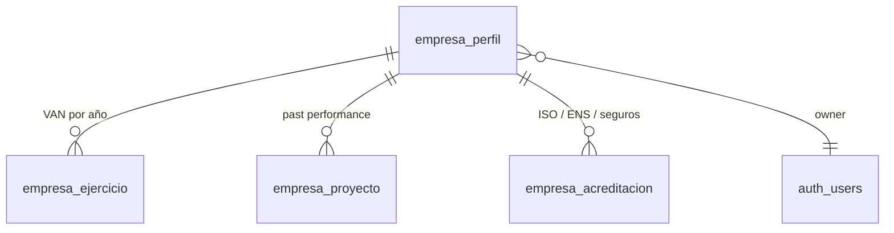

# ADR-002 — Perfil de empresa licitadora

- **Estado:** Propuesta — **requiere decisión de producto antes de implementar**
- **Fecha:** 2026-07-27
- **Ámbito:** modelo de datos del licitador, onboarding y capacidades de la Guía §3 y §5
- **Depende de:** ADR-001 (arquitectura durable, grounded y evaluable)

## Por qué esto es una ADR y no una tarea

Las fases anteriores fueron implementables sin preguntar: había un bug, o una capacidad que
el pipeline ya extraía y nadie interpretaba. Esta no. Introducir el perfil de empresa cambia
tres cosas a la vez —el modelo de datos, el onboarding y la naturaleza del producto— y
ninguna de las tres tiene una respuesta técnicamente obvia.

Este documento deja el diseño listo y **aísla las decisiones que corresponden a producto**
(§7). No se implementa nada hasta que estén tomadas: construir el modelo de datos primero y
preguntar después es exactamente cómo se acaba con un onboarding que nadie completa.

## Contexto

### Lo que hoy tiene la app

El pipeline extrae del pliego, con evidencia, lo que el órgano de contratación **exige**:

| Dato exigido                              | Dónde vive hoy                                            |
| ----------------------------------------- | --------------------------------------------------------- |
| CPV del contrato                          | `datosGenerales.cpv` (`TrackedField<string[]>`)           |
| Cifra de negocio anual mínima             | `requisitosSolvencia.economica.cifraNegocioAnualMinima`   |
| Proyectos similares y su importe mínimo   | `requisitosSolvencia.tecnica[]`                           |
| Solvencia profesional                     | `requisitosSolvencia.profesional[]`                       |
| PBL, valor estimado, duración             | `economico.*`, `datosGenerales.plazoEjecucionMeses`       |
| Fórmula de precio y umbral de anormalidad | interpretados por `src/lib/scoring.ts` (§11 de `SPEC.md`) |

### Lo que falta

**El otro lado de la comparación.** La Guía §3.1.1 lo dice literalmente: «Recuperar
$VAN_{empresa}$ de la base de datos interna». Esa base de datos interna **no existe**. Sin
ella la app enseña el requisito y el licitador comprueba a mano si lo cumple, que es
precisamente el trabajo que venía a ahorrar.

El simulador económico de la fase anterior fue el primer paso del salto de «extractor» a
«analista»: interpreta la fórmula y responde «cuántos puntos saco con este precio». El
perfil es el segundo y más grande: responde **«¿me presento?»**, que es la pregunta que se
hace antes.

## Modelo de datos propuesto

Cuatro tablas nuevas, todas con RLS por `auth.uid()` y ninguna expuesta a escritura desde
el navegador sin validación de schema.

### `empresa_perfil`

Una fila por usuario (o por organización, ver §7.1). Datos que no cambian entre licitaciones.

| Columna                     | Tipo        | Notas                                                      |
| --------------------------- | ----------- | ---------------------------------------------------------- |
| `id`                        | uuid PK     |                                                            |
| `user_id`                   | uuid        | FK a `auth.users`, único mientras el perfil sea individual |
| `razon_social`              | text        |                                                            |
| `nif`                       | text        | Formato validado, **nunca en logs**                        |
| `num_empleados`             | int         | Habilita el chequeo de plan de igualdad (>50, Guía §3.3)   |
| `clasificacion_empresarial` | jsonb       | Grupos/subgrupos/categorías del RD 1098/2001               |
| `created_at` / `updated_at` | timestamptz |                                                            |

### `empresa_ejercicio`

El VAN se declara **por ejercicio**, no como número único. La LCSP pide «el mejor ejercicio
de los últimos tres disponibles»: guardar solo un total obliga al usuario a hacer esa
selección mentalmente y la app pierde la posibilidad de hacerla bien.

| Columna           | Tipo             | Notas                                                                                             |
| ----------------- | ---------------- | ------------------------------------------------------------------------------------------------- |
| `perfil_id`       | uuid             | FK                                                                                                |
| `ejercicio`       | int              | Año                                                                                               |
| `volumen_negocio` | numeric          | Total del ejercicio                                                                               |
| `volumen_ambito`  | numeric nullable | Volumen **en el ámbito** del contrato, si se conoce. Muchos pliegos lo piden así y no es el total |

### `empresa_proyecto`

La _past performance database_ de la Guía §3.2.1.

| Columna                       | Tipo    | Notas                                                                                |
| ----------------------------- | ------- | ------------------------------------------------------------------------------------ |
| `perfil_id`                   | uuid    | FK                                                                                   |
| `denominacion`                | text    |                                                                                      |
| `cliente`                     | text    |                                                                                      |
| `cpv`                         | text[]  | Códigos completos; el truncado a 3 dígitos se hace en consulta, no en almacenamiento |
| `importe`                     | numeric |                                                                                      |
| `fecha_inicio` / `fecha_fin`  | date    | Necesarias para la ventana de 3 años (servicios/suministros) o 5 (obras)             |
| `certificado_buena_ejecucion` | bool    | Un proyecto sin certificado puede no computar                                        |

Índice GIN sobre `cpv` para que el filtro por prefijo no degrade con el histórico.

### `empresa_acreditacion`

| Columna             | Tipo             | Notas                                                        |
| ------------------- | ---------------- | ------------------------------------------------------------ |
| `perfil_id`         | uuid             | FK                                                           |
| `tipo`              | enum             | `iso`, `ens`, `seguro_rc`, `otra`                            |
| `identificador`     | text             | `ISO 9001`, `ENS-Alto`, …                                    |
| `importe_cobertura` | numeric nullable | Solo para seguros (Guía §3.1.2)                              |
| `fecha_caducidad`   | date nullable    | **Una certificación caducada es un no-cumple**, no un cumple |

## Capacidades que desbloquea

### Go/No-Go (Guía §3)

Cuatro chequeos deterministas, ninguno de ellos con LLM:

| Chequeo             | Regla                                                                                                                           | Salida                                |
| ------------------- | ------------------------------------------------------------------------------------------------------------------------------- | ------------------------------------- |
| Solvencia económica | `VAN_empresa` (mejor de 3 ejercicios) vs `cifraNegocioAnualMinima`; si el pliego no lo explicita, `1.5 × (PBL / duración_años)` | Bloqueante / cumple / **desconocido** |
| Solvencia técnica   | Σ importes de proyectos con CPV truncado a 3 dígitos coincidente, dentro de la ventana temporal, vs umbral del pliego           | ídem                                  |
| Acreditaciones      | Cada ISO/ENS exigido contra `empresa_acreditacion` vigente a la fecha límite                                                    | Lista de faltantes                    |
| Seguro RC           | `importe_cobertura` vs el exigido                                                                                               | ídem                                  |

**El tercer estado no es opcional.** Si el pliego no explicita el umbral, o el perfil está
incompleto, la respuesta correcta es «no lo sé y esto es lo que me falta», no un No-Go. Un
falso No-Go hace que el licitador se pierda un contrato que podía ganar: es el error caro,
y es silencioso.

Cuando hay gap económico, la Guía §3.1.1 pide además proponer mitigación (medios externos o
UTE, con el % de participación necesario). Ese cálculo es aritmética sobre el gap y entra
en el mismo motor determinista.

### Win Themes (Guía §5.2)

Requiere la memoria justificativa —que hoy **no se ingiere**— y buscar en ella dolores
(«retrasos», «obsoleto», «quejas», «manual») para convertirlos en discriminadores. Depende
del perfil solo en la mitad final: el «beneficio» creíble es el que la empresa puede
respaldar con proyectos reales de `empresa_proyecto`.

Es la capacidad **menos madura** de las dos y la que más fácilmente degenera en generador de
texto comercial. Propuesta: no entra en el mismo alcance que Go/No-Go.

## Onboarding

El riesgo real de esta fase no es técnico. Es que **el perfil se queda vacío**: un
formulario de cuatro tablas antes de poder analizar un pliego es una barrera que la mayoría
de usuarios no cruza, y un perfil a medias produce Go/No-Go «desconocido» en todo, que se
lee como que la app no funciona.

Tres mitigaciones, en orden de preferencia:

1. **Perfil incremental, disparado por el análisis.** No hay formulario inicial. Tras el
   primer análisis la app dice: «este pliego exige 450.000 € de cifra de negocio — ¿cuál es
   la tuya?». Un campo, con contexto, en el momento en que su utilidad es obvia. El perfil
   se llena solo a base de licitaciones.
2. **Importación desde documentos que la empresa ya tiene.** El mismo pipeline que lee un
   pliego puede leer unas cuentas anuales o un certificado ISO. Reutiliza infraestructura,
   pero es alcance grande y no debería bloquear la 1.
3. **Formulario completo**, disponible siempre para quien quiera rellenarlo de una vez, pero
   nunca como puerta de entrada.

La app debe funcionar sin perfil, exactamente como hoy. El perfil **añade** una sección; no
condiciona el análisis.

## Consecuencias

**Cambia lo que la app es.** Deja de ser una herramienta de lectura y pasa a emitir juicios
sobre la empresa del usuario. Un Go/No-Go equivocado tiene consecuencias que un campo mal
extraído no tiene, y eso sube el listón de lo que se puede mostrar sin evidencia.

**Datos sensibles nuevos.** NIF, cifras de negocio y cartera de clientes son datos de
negocio confidenciales. Implica: RLS estricta, nunca en logs ni en spans `[trace]` —el
allowlist de `sanitizeSpanData` ya está preparado para esto—, y una decisión explícita sobre
si estos datos pueden viajar a OpenAI (§7.3).

**Deuda de mantenimiento.** Un perfil desactualizado es peor que ninguno: da respuestas con
seguridad sobre datos de hace tres años. Necesita recordatorio de revisión y, como mínimo,
mostrar la antigüedad del dato junto al veredicto.

## Decisiones que corresponden a producto

Ninguna de estas la puede tomar quien implementa.

### 7.1 ¿Perfil por usuario o por organización?

Hoy todo el modelo es `user_id`. Un perfil de empresa compartido entre varios usuarios
implica tabla de organizaciones, invitaciones, roles y RLS por pertenencia — es una fase en
sí misma. Un perfil por usuario se implementa en días, pero duplica datos si en la misma
empresa lo usan dos personas, y migrar después es doloroso.

**Recomendación:** empezar por usuario, con `perfil_id` como clave desde el primer día (no
`user_id` directo en las tablas hijas) para que la migración a organización sea añadir una
columna y no reescribir el modelo.

### 7.2 ¿Entra Win Themes en este alcance?

**Recomendación:** no. Go/No-Go es determinista, verificable y responde la pregunta más
valiosa. Win Themes necesita ingerir un documento nuevo, genera texto y es difícil de
evaluar. Mezclarlos hace que un alcance verificable dependa de uno que no lo es.

### 7.3 ¿Los datos del perfil viajan a OpenAI?

El Go/No-Go determinista **no los necesita**: compara números en Postgres. Pero si el
copiloto conversacional debe responder «¿cumplo la solvencia?», el perfil entra en su
contexto.

**Recomendación:** que el copiloto consulte el veredicto ya calculado mediante una tool
read-only, en vez de recibir el perfil crudo en el prompt. Responde igual de bien y las
cifras de negocio no salen de la base de datos.

### 7.4 ¿Qué se muestra cuando el perfil está incompleto?

**Recomendación:** el requisito extraído del pliego, el estado «no verificable» y el campo
concreto que falta, con enlace para rellenarlo. Nunca un veredicto de cumplimiento sobre un
dato ausente.

## Alternativas descartadas

**Inferir el perfil de análisis anteriores.** Tentador y erróneo: de que alguien analice
pliegos de limpieza no se sigue que tenga experiencia en limpieza. Inventaría el dato que
justifica el veredicto.

**Un solo campo «facturación anual».** Más simple de rellenar, pero no permite «mejor
ejercicio de los últimos tres» ni distinguir volumen total de volumen en el ámbito, que es
justo donde se decide la mitad de las exclusiones por solvencia.

**Go/No-Go con LLM.** Es aritmética con reglas escritas en la LCSP. Un modelo aportaría
variabilidad donde hace falta una respuesta reproducible y auditable, y volvería inevaluable
lo que hoy sería un test unitario.

## Plan de implementación propuesto

Una vez tomadas las decisiones de §7:

1. **Migración + RLS.** Cuatro tablas, políticas owner-scoped, sin escritura directa desde
   el navegador salvo `safeParse` previo. Cero UI.
2. **Motor determinista** en `src/lib/` —al lado de `scoring.ts`, mismo patrón de funciones
   puras que devuelven fallo explícito con motivo en vez de adivinar—, con tests unitarios
   por cada regla de la Guía §3.
3. **Captura incremental**: el prompt de un campo, en contexto, tras el análisis.
4. **Panel Go/No-Go** en el dashboard, con los tres estados y la antigüedad del dato.
5. **Tool read-only del copiloto** sobre el veredicto calculado.

Los pasos 1 y 2 son verificables en CI de punta a punta y no cambian nada visible; el 3 es
el que decide si esto se usa o no.

## Fuentes de referencia

- `supabase/functions/analyze-with-agents/guia-lectura-pliegos.md` §3 (Go/No-Go), §5.2 (Win
  Themes), §3.3 (prohibiciones de contratar)
- `docs/adr/ADR-001-arquitectura-ia-durable-y-evaluable.md` — separación entre extracción y
  motores deterministas
- `SPEC.md` §11 — simulación económica, precedente del patrón «no adivinar»
